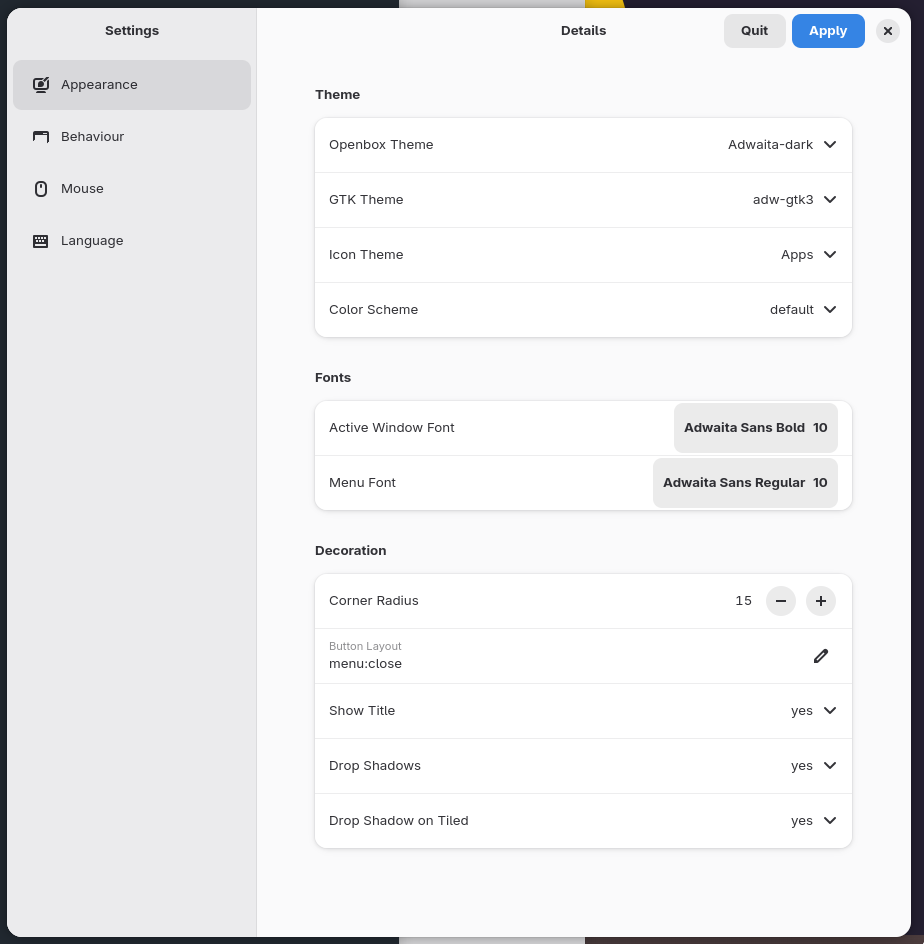

# labwc-tweaks-gtk4

This is a [WIP] configuration gui app for labwc without any real plan or
Acceptance Criteria. It was merely written to help change themes for the
purposes of testing labwc during development. Don't expect too much :smile:



If you install labwc-gtktheme.py and set labwc-theme to GTK it'll
automatically sync with the selected GTK theme.

### build

```
meson setup build
meson compile -C build
```

### install

```
meson install -C build
```

This installs the binary to /usr/local/bin and data files to their respective locations.

If you find it a useful tool and want to expand its scope, feel free.

### translation

See [NLS instructions](./NLS.md) for information for **translators** to translate
using [Weblate] or pull request and **code contributor** guidelines.

#### translation status


[Weblate]: https://hosted.weblate.org/projects/labwc-tweaks-gtk/
